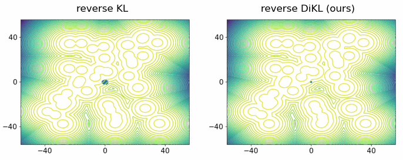

# Training Neural Samplers with Reverse Diffusive KL Divergence (DiKL)


[](https://arxiv.org/abs/2410.12456)


Official PyTorch implementation of the paper [Training Neural Samplers with Reverse Diffusive KL Divergence](https://arxiv.org/abs/2410.12456).

In this paper, we introduce Diffusive KL Divergence (DiKL), a reverse-KL-based divergence that promotes mode-covering behavior, in contrast to the standard reverse KL, which tends to focus on mode-seeking:



## Reproducing results for DiKL and Baselines
### Samples
You can directly download samples on MoG-40, MW-32, DW-4, and LJ-13 generated by our methods and baselines (iDEM, FAB, reverse KL) in the following links to rapidly reproduce our plots and metrics.

### Model Weights
You can also download model weights below:

## Environment Setup
- python 3.11
- torch 2.4.0
- numpy 1.23.0
- scipy 1.12.0
- tqdm
- matplotlib
- bgflow (see instruction below)
  
To install bgflow:
1. Clone [bgflow repository](https://github.com/noegroup/bgflow)
2. Navigate to the cloned repository folder
3. Run the installation script:
```
python setup.py install
```

## Training Neural Sampler with DiKL

To train the neural sampler with DiKL, navigate to folder ```DiKL```, and run
```
python train.py --target mog/dw/lj/mw --seed 0 --device cuda
```

## Evaluation

## Citation

If you find our paper, code, and/or data useful for your research, please cite our paper:

```
@article{he2024training,
  title={Training Neural Samplers with Reverse Diffusive KL Divergence},
  author={He, Jiajun and Chen, Wenlin and Zhang, Mingtian and Barber, David and Hern{\'a}ndez-Lobato, Jos{\'e} Miguel},
  journal={arXiv preprint arXiv:2410.12456},
  year={2024}
}
```
